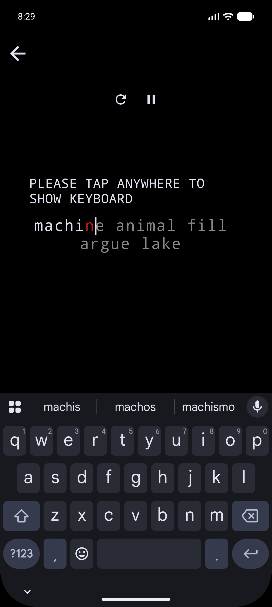
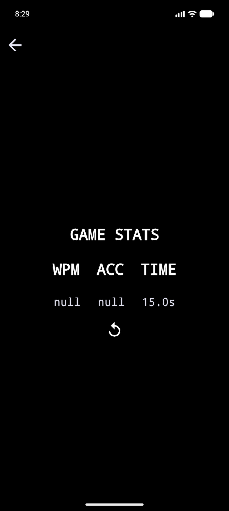
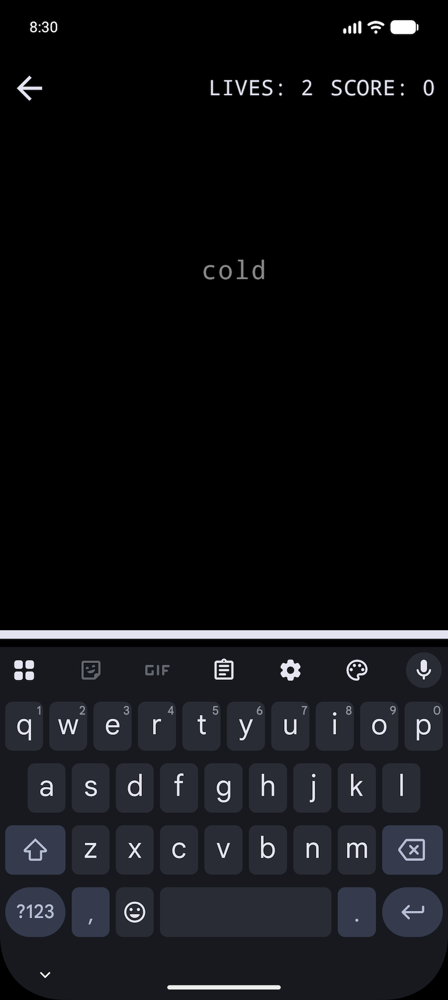
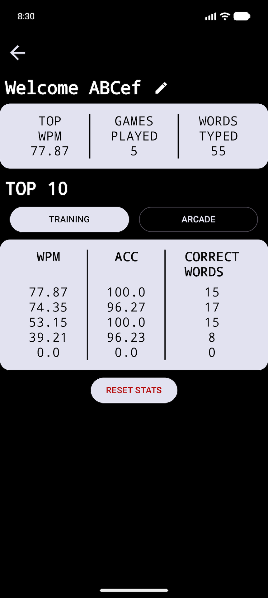

# KeyRace
Typing speed racing game for Android built with Kotlin and Jetpack Compose. 

## Features
#### Training Mode
- Choose a training duration
- Choose a target number of words to type
- Measure typing speed
- Track typing accuracy
- Display a summary after each session

  
  

#### Arcade Mode
- Words fall from the top of the screen
- The player has to type the words before they disappear

  

#### Profile Screen with Stats

  

## Tech Stack
- **Kotlin** — main programming language
- **Jetpack Compose** — modern declarative UI toolkit for Android
- **Room Database** — local data persistence
- **Hilt** — dependency injection
- **Android SDK** — Android app development
- **Gradle** — build system

## How to run

#### Download
The latest APK will be in the **Releases** section
And soon on **uptodown**

#### In Android Studio
1. Clone the repository
2. Open project in Android Studio
3. Sync Gradle project
4. Run the app on the emulator

## Author & License
Mateusz Jędrkowiak

This project is licensed under the MIT License. See the [LICENSE](LICENSE) file for details.
