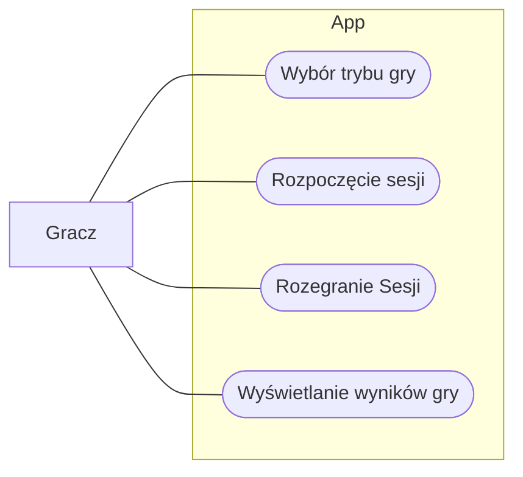
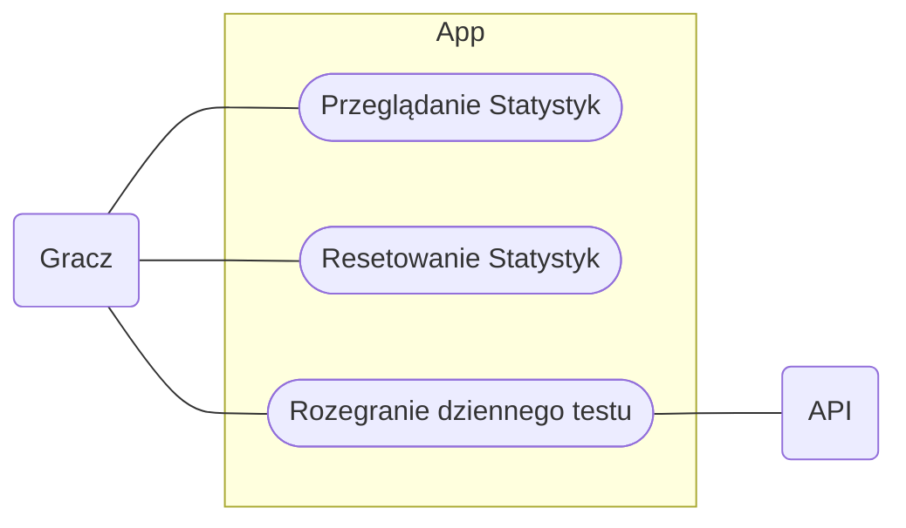

```mermaid
graph LR
	 A[Gracz]

	subgraph App
		UC1([Wybór trybu gry])
		UC2([Rozpoczęcie sesji])
		UC3([Rozegranie Sesji])
		UC4([Wyświetlanie wyników gry])
	end
	
	A --- UC1 
	A --- UC2 
	A --- UC3 
	A --- UC4 
```

```mermaid
graph LR
	A(Gracz)
	
	subgraph App
		UC5([Przeglądanie Statystyk])
		UC6([Resetowanie Statystyk])
		UC7([Rozegranie dziennego testu])
	end
	
	A --- UC5 
	A --- UC6
	A --- UC7
	
	API(API)
	UC7 --- API
```

