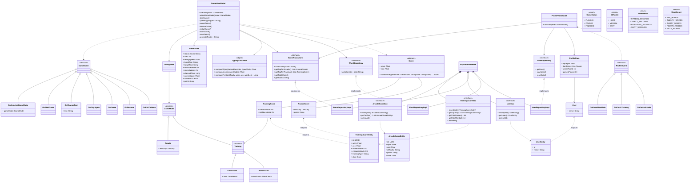

```mermaid
classDiagram


class GameMode { <<abstract>> }
class Arcade { + difficulty: Difficulty }
class Training { <<abstract>> }
class TimeBased { + time: TimePeriod }
class WordBased { + wordCount: WordCount }


class GameEvent { <<abstract>> }
class OnSelectedGameMode { + gameMode: GameMode }
class OnStartGame { }
class OnChangeText { + text: String }
class OnPlayAgain { }
class OnPause { }
class OnResume { }
class OnExitToMenu { }

class ConfigState { }
class GameState {
    + status: GameStatus
    + lifes: Int
    + fallingSpeed: Float
    + typedText: String
    + targetText: String
    + mistakesMade: Int
    + correctWords: Int
    + elapsedTime: Long
    + currentWpm: Float
    + currentAcc: Float
    + points: Long
}

class GameViewModel {
    + onEvent(event: GameEvent)
    - selectGameMode(mode: GameMode)
    - startGame()
    - updateTyping(text: String)
    - pauseGame()
    - resumeGame()
    - restartGame()
    - finishGame()
    - saveResult()
    - generateText(): String
}

class TypingCalculator {
    <<object>>
    + computeWpm(elapsedSeconds, typedText) Float
    + computeAcc(mistakesMade) Float
    + computePoints(difficulty, wpm, acc, wordLen) Long
}


class Score {
    <<abstract>>
    + wpm: Float
    + acc: Float
    + buildScore(gameState: GameState, configState: ConfigState): Score
}
class TrainingScore {
    + correctWords: Int
    + mistakesMade: Int
}
class ArcadeScore {
    + difficulty: Difficulty
    + points: Long
}

class ProfileEvent { <<abstract>> }
class OnResetUserData { }
class OnFetchTraining { }
class OnFetchArcade { }

class ProfileState {
    + topWpm: Float
    + topScores: List~Score~
    + wordsTyped: Int
    + gamesPlayed: Int
}

class ProfileViewModel { 
    + onEvent(event: ProfileEvent) 
}

class User { + name: String }


class TrainingScoreEntity {
    + id: UUID
    + wpm: Float
    + acc: Float
    + correctWords: Int
    + mistakesMade: Int
    + trainingType: String
    + date: Date
}
class ArcadeScoreEntity {
    + id: UUID
    + wpm: Float
    + acc: Float
    + difficulty: String
    + points: Long
    + date: Date
}
class UserEntity {
    + id
    + name: String
}


class KeyRaceDatabase { }

class ArcadeScoreDao {
    <<interface>>
    + insert(entity: ArcadeScoreEntity)
    + getTopTen() List~ArcadeScoreEntity~
    + deleteAll()
}
class TrainingScoreDao {
    <<interface>>
    + insert(entity: TrainingScoreEntity)
    + getTopTen() List~TrainingScoreEntity~
    + getTotalGames() Int
    + getTotalWords() Int
    + deleteAll()
}
class UserDao {
    <<interface>>
    + insert(entity: UserEntity)
    + getUser() UserEntity
    + deleteAll()
}


class ScoreRepository {
    <<interface>>
    + saveGame(score: Score)
    + getTopTenArcade() List~ArcadeScore~
    + getTopTenTraining() List~TrainingScore~
    + getTotalWords()
    + getTotalGames()
}
class ScoreRepositoryImpl { }

class WordRepository {
    <<interface>>
    + getWords(): List~String~
}
class WordRepositoryImpl { }

class UserRepository {
    <<interface>>
    + getUser()
    + saveUser()
    + resetData()
}
class UserRepositoryImpl { }


class GameStatus {
    <<enum>>
    + PLAYING
    + PAUSED
    + FINISHED
}
class Difficulty {
    <<enum>>
    + HARD
    + MEDIUM
    + EASY
}
class TimePeriod {
    <<enum>>
    + FIFTEEN_SECONDS
    + THIRTY_SECONDS
    + FORTYFIVE_SECONDS
    + SIXTY_SECONDS
}
class WordCount {
    <<enum>>
    + TEN_WORDS
    + TWENTY_WORDS
    + THIRTY_WORDS
    + FOURTY_WORDS
    + FIFTY_WORDS
}


GameMode <|-- Arcade
GameMode <|-- Training
Training <|-- TimeBased
Training <|-- WordBased

GameEvent <|-- OnSelectedGameMode
GameEvent <|-- OnStartGame
GameEvent <|-- OnChangeText
GameEvent <|-- OnPlayAgain
GameEvent <|-- OnPause
GameEvent <|-- OnResume
GameEvent <|-- OnExitToMenu

Score <|-- TrainingScore
Score <|-- ArcadeScore

ProfileEvent <|-- OnResetUserData
ProfileEvent <|-- OnFetchTraining
ProfileEvent <|-- OnFetchArcade

ScoreRepository <|.. ScoreRepositoryImpl : implements
WordRepository <|.. WordRepositoryImpl : implements
UserRepository <|.. UserRepositoryImpl : implements


TrainingScore --> Training
ConfigState --> GameMode
TrainingScore <.. TrainingScoreEntity : maps to
ArcadeScore <.. ArcadeScoreEntity : maps to
User <.. UserEntity : maps to

GameViewModel ..> GameEvent
GameViewModel --> ConfigState
GameViewModel --> GameState
GameViewModel --> ScoreRepository
GameViewModel --> TypingCalculator
GameViewModel --> WordRepository
GameViewModel ..> Score

ProfileViewModel --> ScoreRepository
ProfileViewModel --> UserRepository
ProfileViewModel --> ProfileState
ProfileViewModel <.. ProfileEvent
ProfileState --> User

KeyRaceDatabase *-- ArcadeScoreDao
KeyRaceDatabase *-- TrainingScoreDao
KeyRaceDatabase *-- UserDao

KeyRaceDatabase <-- ScoreRepositoryImpl
KeyRaceDatabase <-- WordRepositoryImpl
KeyRaceDatabase <-- UserRepositoryImpl

ArcadeScoreDao ..> ArcadeScoreEntity
TrainingScoreDao ..> TrainingScoreEntity
UserDao ..> UserEntity

```

