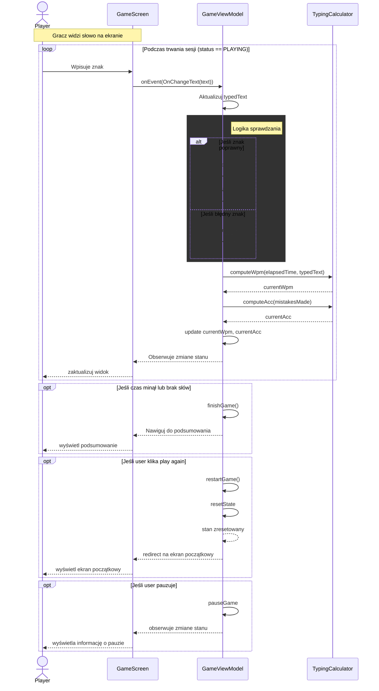
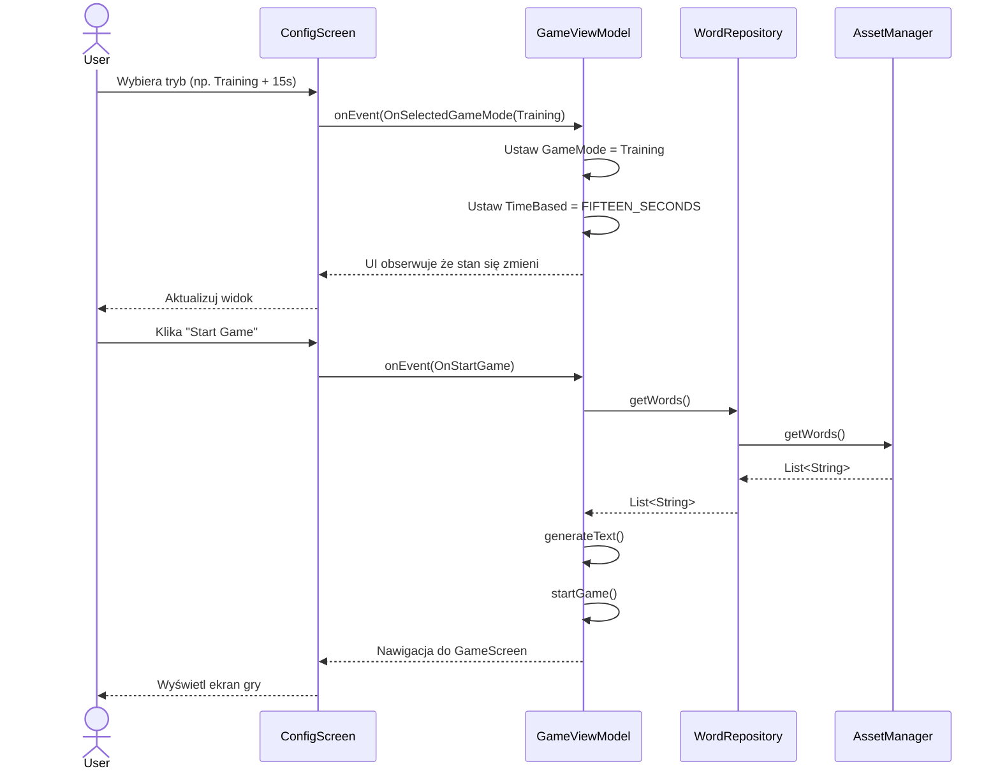
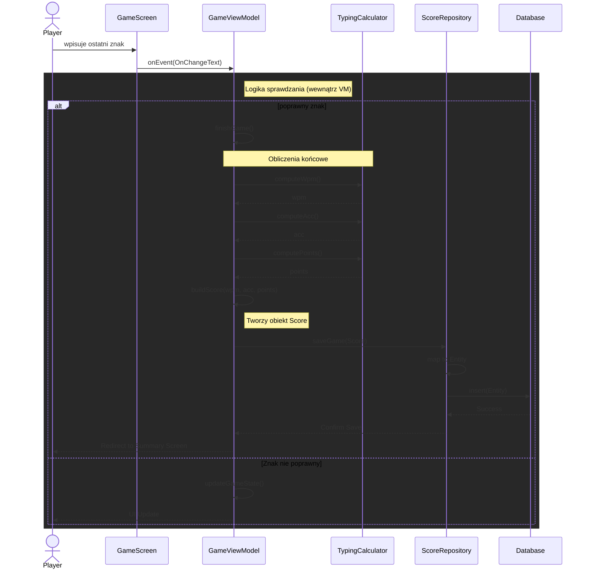
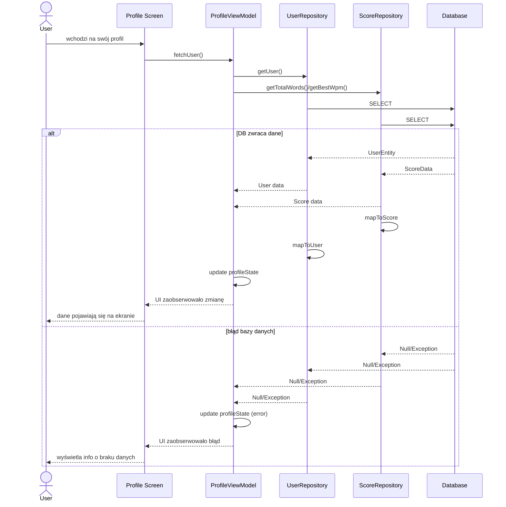

## Gra

```mermaid
sequenceDiagram
actor Player
participant UI as GameScreen
participant VM as GameViewModel
participant Calc as TypingCalculator
Note over Player, UI: Gracz widzi słowo na ekranie
loop Podczas trwania sesji (status == PLAYING)
Player->>UI: Wpisuje znak
UI->>VM: onEvent(OnChangeText(text))
VM->>VM: Aktualizuj typedText
rect rgb(50, 50, 50)
Note right of VM: Logika sprawdzania
alt Jeśli znak poprawny
VM->>VM: inkrementuj correctWords
VM->>VM: generateNextWord()
else Jeśli błędny znak
VM->>VM: inkrementuj mistakesMade
end
end
VM->>Calc: computeWpm(elapsedTime, typedText)
Calc-->>VM: currentWpm
VM->>Calc: computeAcc(mistakesMade)
Calc-->>VM: currentAcc
VM->>VM: update currentWpm, currentAcc
VM-->>UI: Obserwuje zmiane stanu
UI-->>Player: zaktualizuj widok
end
opt Jeśli czas minął lub brak słów
VM->>VM: finishGame()
VM-->>UI: Nawiguj do podsumowania
UI-->>Player: wyświetl podsumowanie
end
opt Jeśli user klika play again
VM->>VM: restartGame()
VM->>VM: resetState
VM-->>VM: stan zresetowany
VM-->>UI: redirect na ekran początkowy
UI-->>Player: wyświetl ekran początkowy
end
opt Jeśli user pauzuje
VM->>VM: pauseGame
VM-->>UI: obserwuje zmiane stanu
UI-->>Player: wyświetla informację o pauzie
end
```

## Wybór trybu

```mermaid

sequenceDiagram

actor User

participant UI as ConfigScreen

participant VM as GameViewModel


participant WR as WordRepository

participant AM as AssetManager

  

User->>UI: Wybiera tryb (np. Training + 15s)

UI->>VM: onEvent(OnSelectedGameMode(Training)

  

VM->>VM: Ustaw GameMode = Training

VM->>VM: Ustaw TimeBased = FIFTEEN_SECONDS

VM -->> UI : UI obserwuje że stan się zmieni
UI-->> User : Aktualizuj widok

User->>UI: Klika "Start Game"

UI->>VM: onEvent(OnStartGame)

VM->>WR: getWords()

  

WR->>AM: getWords()

  

AM -->> WR: List<String>

WR-->>VM: List<String>

  

VM->>VM: generateText()

VM->>VM: startGame()

VM-->>UI: Nawigacja do GameScreen
UI-->> User: Wyświetl ekran gry
```

### Koniec Gry

```mermaid
sequenceDiagram
    actor P as Player
    participant UI as GameScreen
    participant VM as GameViewModel
    participant Calc as TypingCalculator
    participant Repo as ScoreRepository
    participant DB as Database
    
    P->>UI: wpisuje ostatni znak
    UI->>VM: onEvent(OnChangeText)
    rect rgb(40, 40, 40)
	Note right of VM: Logika sprawdzania (wewnątrz VM)
	
	alt poprawny znak
		VM->>VM: finishGame()
	    Note over VM, Calc: Obliczenia końcowe
	    VM->>Calc: computeWpm()
	    Calc-->>VM: wpm
	    VM->>Calc: computeAcc()
	    Calc-->>VM: acc
	    VM->>Calc: computePoints()
	    Calc-->>VM: points
	    VM->>VM: buildScore(wpm, acc, points)
	    
	    Note right of VM: Tworzy obiekt Score
	    VM->>Repo: saveGame(Score)
	    Repo->>Repo: map to Entity
	    Repo->>DB: insert(Entity)
	    DB-->>Repo: Success
	    Repo-->>VM: Confirm Save
	    VM-->>P: Redirect to Summary Screen
	    else Znak nie poprawny
	    VM->>VM: updateGameState()
	    VM-->>P: UI Update
	end
end
```

### Profil użytkownika

```mermaid
sequenceDiagram
    actor User
    participant UI as Profile Screen
    participant VM as ProfileViewModel
    participant UR as UserRepository
    participant SR as ScoreRepository
    participant DB as Database

    User->>UI: wchodzi na swój profil
    UI->>VM: fetchUser()
    VM->>UR: getUser()
    VM->>SR: getTotalWords()/getBestWpm()
    UR->>DB: SELECT
    SR->>DB: SELECT

    alt DB zwraca dane
        DB-->>UR: UserEntity
        DB-->>SR: ScoreData
        UR-->>VM: User data
        SR-->>VM: Score data
        SR ->> SR : mapToScore
        UR ->> UR : mapToUser
        VM->>VM: update profileState
        VM-->>UI: UI zaobserwowało zmianę
        UI-->>User: dane pojawiają się na ekranie
    else błąd bazy danych
        DB-->>SR: Null/Exception
        DB-->>UR: Null/Exception
        SR-->>VM: Null/Exception
        UR-->>VM: Null/Exception
        VM->>VM: update profileState (error)
        VM-->>UI: UI zaobserwowało błąd
        UI-->>User: wyświetla info o braku danych
    end
```

