# SPIS TREŚCI
- [FR-01 - Tryby treningowe 15s, 30s, 60s](#fr-01-tryby-treningowe-15s-30s-60s)    
    - [TC-01](#tc-01)
    - [TC-02](#tc-02)
    - [TC-03](#tc-03)
- [FR-02 - Ekran statystyk po rozegranej grze](#fr-02-ekran-statystyk-po-rozegranej-grze)
    - [TC-04 - Tryb Training Time](#tc-04-tryb-training-time)
    - [TC-05 - Tryb Training Words](#tc-05-tryb-training-words)
    - [TC-06 - Tryb Arcade](#tc-06-tryb-arcade)
- [FR-03 - Przycisk Play again](#fr-03-przycisk-play-again)
    - [TC-07 - Tryb Training Time](#tc-07-tryb-training-time)
    - [TC-08 - Tryb Arcade](#tc-08-tryb-arcade)
    - [TC-09 - Tryb Training Words](#tc-09-tryb-training-words)
- [FR-05 - Tryb Arcade](#fr-05-tryb-arcade)
    - [TC-10 - Możliwa gra w trybie Arcade](#tc-10-mozliwa-gra-w-trybie-arcade)
    - [TC-11 - Możliwość wyboru poziomu trudności w trybie Arcade](#tc-11-mozliwosc-wyboru-poziomu-trudnosci-w-trybie-arcade)
    - [TC-12 - W trybie Arcade trzeba wpisywać słowa zanim spadną](#tc-12-w-trybie-arcade-trzeba-wpisywac-slowa-zanim-spadna)
- [FR-09 - Dynamiczna zmiana koloru przy wpisywaniu](#fr-09-dynamiczna-zmiana-koloru-przy-wpisywaniu)
    - [TC-13 - Niewpisane litery pojawiają się na szaro](#tc-13-niewpisane-litery-pojawiaja-sie-na-szaro)
    - [TC-14 - Wpisane litery pojawiają się na biało](#tc-14-wpisane-litery-pojawiaja-sie-na-bialo)
    - [TC-15 - Błędnie wpisane litery mają czerwony kolor](#tc-15-blednie-wpisane-litery-maja-czerwony-kolor)
- [FR-10 - Wgląd w 10 poprzednich gier](#fr-10-wglad-w-10-poprzednich-gier)
    - [TC-16 - Możliwość wyświetlenia statystyk z poprzednich 10 gier Arcade](#tc-16-mozliwosc-wyswietlenia-statystyk-z-poprzednich-10-gier-arcade)
    - [TC-17 - Możliwość wyświetlenia statystyk z poprzednich 10 gier Training](#tc-17-mozliwosc-wyswietlenia-statystyk-z-poprzednich-10-gier-training)
    - [TC-18 - Możliwość resetu statystyk](#tc-18-mozliwosc-resetu-statystyk)

Pomijam:
- FR-04 - Globalny ranking - bo miało być "WONT HAVE"
- FR-06 - System osiągnięć - też "COULD HAVE"
- FR-07 - Daily Test - gra przede wszystkim miała być online i też "COULD HAVE"
Dlatego też zamieszczam po 3 test-case'y dla każdego z pozostałych wymagań.
## FR-01 - Tryby treningowe 15s, 30s, 60s
##### TC-01

**Opis** : Sprawdzenie czy użytkownik może rozgerać grę trwającą 15s
Kroki:
1. Uruchom Apkę
2. Wybierz Training a następnie Time i 15
3. Kliknij START
4. Zacznij pisać i czekaj aż minie 15s - po tym czasie gra powinna zakończyć się i wyświetlić ekran statystyk
**Oczekiwany Rezultat**: Gra uruchamia się następnie po wpisywaniu znaków i upływie 15s kończy się i wyświetla się ekran statystyk.
**Rzeczywisty rezultat**:

  
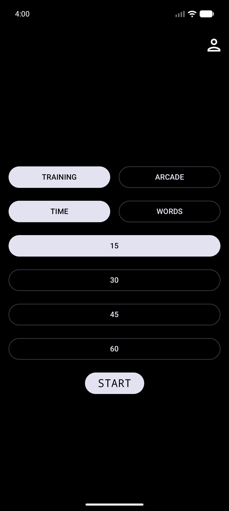  
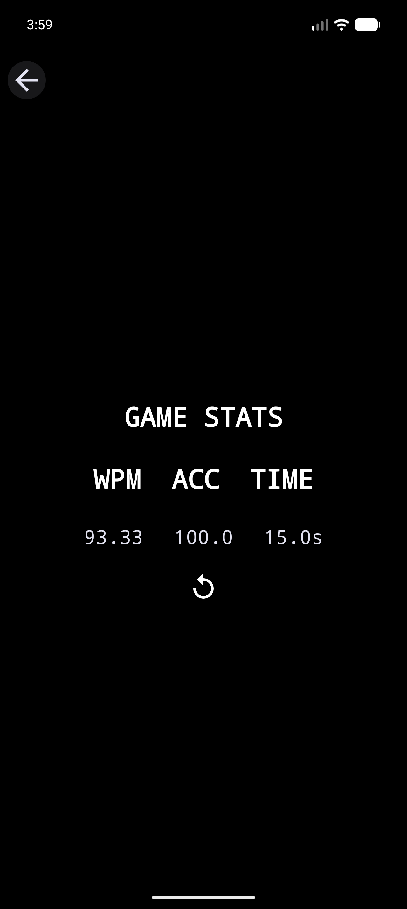  

**Wynik**: OK

##### TC-02

**Opis**: sprawdzenie czy użytkownik może rozegrać grę trwającą 30s.
**Kroki** :
1. Uruchom Apkę
2. Wybierz Training a następnie Time i odpowiedni czas
3. Kliknij START
4. Zacznij pisać i czekaj aż minie wybrany czas - po tym czasie gra powinna zakończyć się i wyświetlić ekran statystyk
**Oczekiwany rezultat**: Gra uruchamia się i po upływie wybranego czasu kończy się i wyświetla się ekran statystyk
**Rzeczywisty rezultat:

  
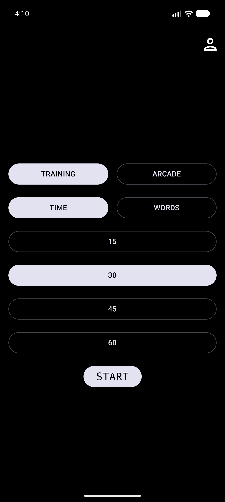  
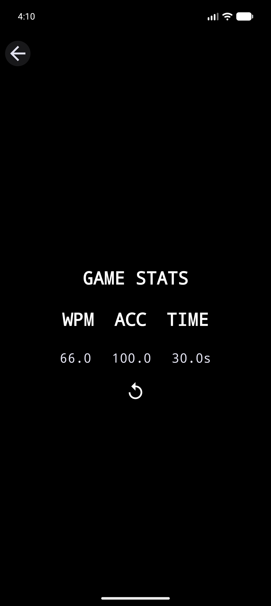  

**Wynik**: OK
##### TC-03

**Opis**: Użytkownik może rozegrać grę trwającą 60s
**Kroki** :
1. Uruchom Apkę
2. Wybierz Training a następnie Time i odpowiedni czas
3. Kliknij START
4. Zacznij pisać i czekaj aż minie wybrany czas - po tym czasie gra powinna zakończyć się i wyświetlić ekran statystyk
**Oczekiwany rezultat**: Gra uruchamia się i po upływie wybranego czasu kończy się i wyświetla się ekran statystyk
**Rzeczywisty rezultat**:

  
  
  

**Wynik**: OK
## FR-02 - Ekran Statystyk po rozegranej grze

##### TC-04 - Tryb Training (Time)

**Opis:** Sprawdzenie, czy po zakończeniu testu w trybie treningowym wyświetla się wynik WPM, ACC.
**Kroki do wykonania:**
1. Uruchom dowolny test, np. 15s.
2. Wpisuj tekst do końca czasu.
3. Poczekaj na zakończenie testu.
4. Sprawdź ekran podsumowania.

**Oczekiwany rezultat:**  
Po zakończeniu testu wyświetla się wynik WPM, ACC.
**Rzeczywisty rezultat:**  

  
  

**Wynik testu:** OK

##### TC-05 - Tryb Training (WORDS)

**Opis:** Sprawdzenie, czy po zakończeniu testu w trybie Training wyświetla się wynik - WPM, ACC i czas gry.
**Kroki do wykonania:**
1. Uruchom grę w trybie Training i wybrać ilość słów.
2. Wpisuj tekst do końca.
3. Sprawdź ekran podsumowania.
**Oczekiwany rezultat:**  
Po zakończeniu testu wyświetla się wynik WPM i ACC.
**Rzeczywisty rezultat:**

  
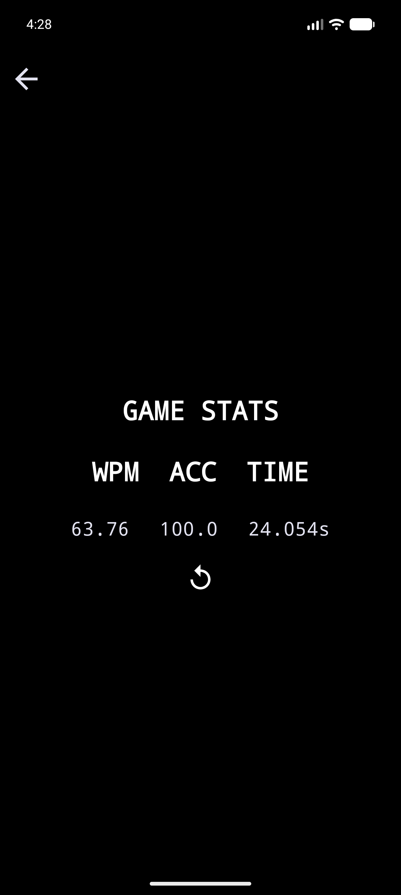  

**Wynik testu:** OK 
##### TC-06 - Tryb Arcade

**Opis:** Sprawdzenie, czy po zakończeniu testu w trybie Arcade wyświetla się wynik SCORE.
**Kroki do wykonania:**
1. Uruchom gre w trybie Arcade.
2. Wpisuj tekst do utraty żyć
3. Sprawdź ekran podsumowania.
**Oczekiwany rezultat:**  
Po zakończeniu testu wyświetla się wynik SCORE.
**Rzeczywisty rezultat:**  

  
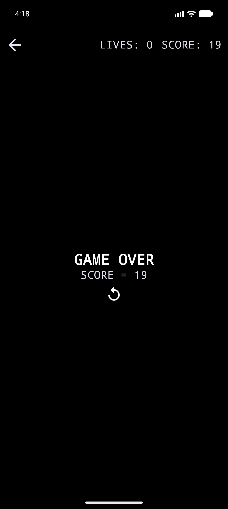  

**Wynik testu:** OK 
## FR-03 — Przycisk „Play again”

##### TC-07 - Tryb Training (TIMES)

**Opis:** Sprawdzenie, czy po zakończeniu testu pojawia się przycisk „Play again”(ikonka replay).
**Kroki do wykonania:**
1. Uruchom gre w trybie training 15s.
2. Poczekaj do zakończenia czasu.
3. Sprawdź ekran podsumowania.
**Oczekiwany rezultat:**  
Na ekranie wyników widoczny jest przycisk „Play again” - Ikonka replay.
**Rzeczywisty rezultat:**  

  
  

**Wynik testu:** OK
##### TC-08 - Tryb Arcade

**Opis:** Sprawdzenie, czy po zakończeniu testu pojawia się przycisk „Play again”.
**Kroki do wykonania:**
1. Uruchom gre w trybie Arcade.
2. Rozegraj gre aż do utraty wszystkich żyć
3. Sprawdź ekran podsumowania.
**Oczekiwany rezultat:**  
Na ekranie wyników widoczny jest przycisk „Play again”(ikonka replay).
**Rzeczywisty rezultat** 

  
  

**Wynik testu:** OK

##### TC-09 - Tryb Training Words

**Opis:** Sprawdzenie, czy po zakończeniu testu w trybie Training + WORDS.
**Kroki do wykonania:**
1. Uruchom grę w trybie Training i wybrać ilość słów.
2. Wpisuj tekst do końca.
3. Sprawdź ekran podsumowania.
**Oczekiwany rezultat:**  
Po zakończeniu testu wyświetla się ikonka replay
**Rzeczywisty rezultat:**

  
  

**Wynik testu:** OK 
## FR-05 - Tryb Arcade
##### TC-10 - Możliwa Gra w trybie Arcade

**Opis:** Sprawdzenie, czy użytkownik może uruchomić tryb Arcade.
**Kroki do wykonania:**
1. Wejdź do aplikacji.
2. Wybierz tryb Arcade.
3. Rozpocznij grę.
**Oczekiwany rezultat:**  
Tryb Arcade uruchamia się poprawnie i użytkownik może rozpocząć rozgrywkę.
**Rzeczywisty rezultat:**  

  
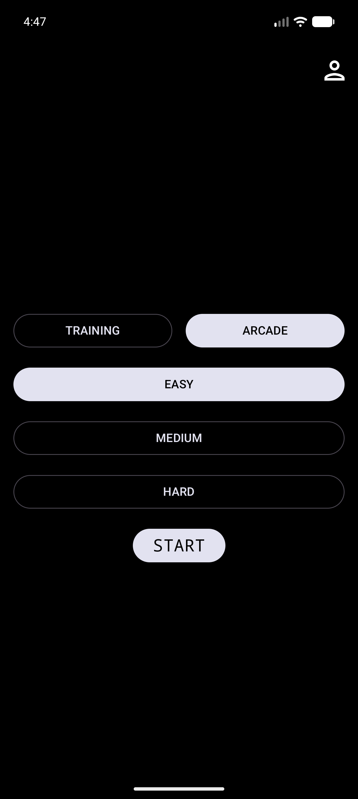  
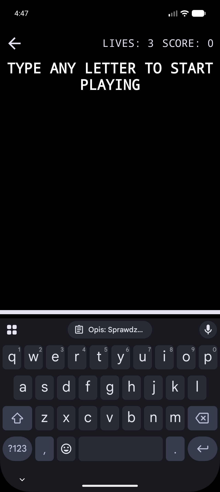  

**Wynik testu:** OK
##### TC-11 - Możliwość wyboru poziomu trudności w trybie Arcade

**Opis:** Sprawdzenie, czy użytkownik może wybrać poziom trudności i zmieni to liczbę żyć.
**Kroki do wykonania:**
1. Wejdź do aplikacji.
2. Wybierz tryb Arcade.
3. Sprawdź czy dostępne są 3 poziomy trudności
4. Wejdź w każdy z nich i sprawdź liczbę żyć.
**Oczekiwany rezultat:**  
Dostępne 3 poziomy trudności: EASY - 3 życie, MEDIUM - 2 życia, HARD - 3 życia.
**Rzeczywisty rezultat:**  

  
  
  
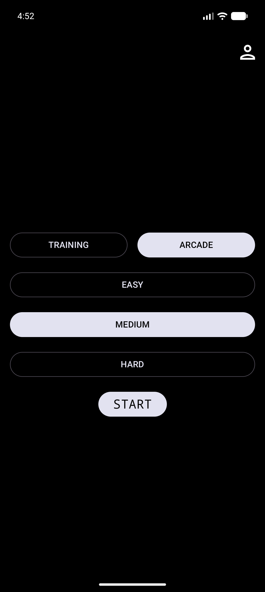  
  
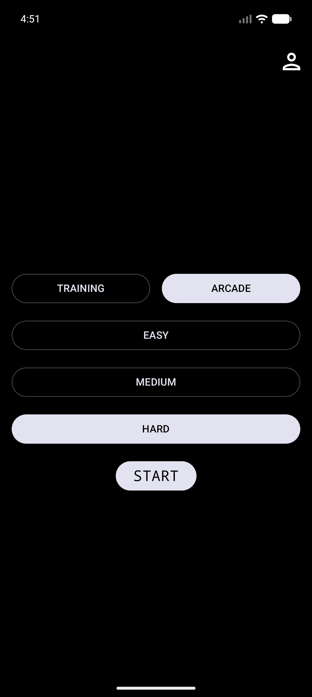  
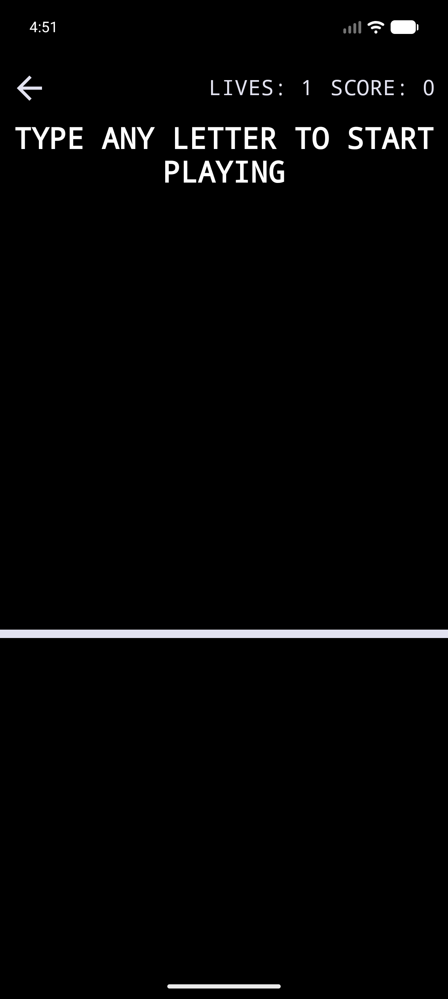  

**Wynik testu:** OK
##### TC-12 - W trybie Arcade trzeba wpisywać słowa zanim spadną.

**Opis:** Sprawdzenie, czy użytkownik może uruchomić tryb Arcade.
**Kroki do wykonania:**
1. Wejdź do aplikacji.
2. Wybierz tryb Arcade.
3. Rozpocznij grę.
4. Zobacz czy słowa spadają
**Oczekiwany rezultat:**  
Tryb Arcade uruchamia się poprawnie i słowa zaczynają spadać
**Rzeczywisty rezultat:**  

  
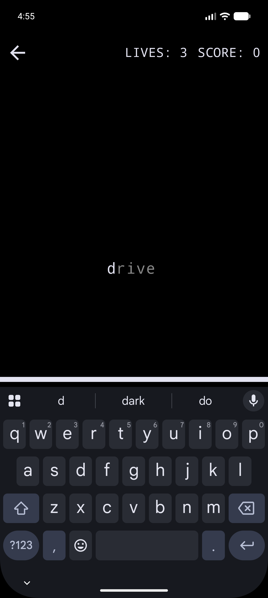 

**Wynik testu:** OK
## FR-09 - Dynamiczna zmiana koloru przy wpisywaniu
##### TC-13 - Nie wpisane litery pojawiają się na szaro

**Opis:** Sprawdzenie, czy niewpisany tekst jest szary
**Kroki do wykonania:**
1. Uruchom test.
2. Zobaczy wyświetlony tekst
3. Obserwuj kolor wpisywanego tekstu.

**Oczekiwany rezultat:**  
Na początku wszystkie litery są na szaro

**Rzeczywisty rezultat:**  

  
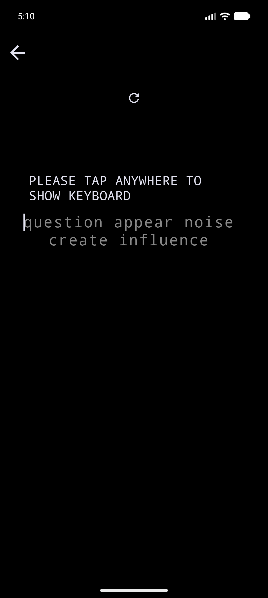 

**Wynik testu:** OK / NOK
##### TC-14 - Wpisane litery pojawiają się na biało

**Opis:** Sprawdzenie, czy niewpisany tekst jest szary
**Kroki do wykonania:**
1. Uruchom test.
2. Zobaczy wyświetlony tekst
3. Zacznij wpisywać go i obserwuj czy poprawnie wpisane znaki zmieniają kolor na biały
**Oczekiwany rezultat:**  
Wpisane litery są białe.
**Rzeczywisty rezultat:**  

  
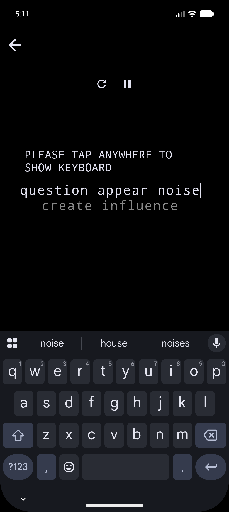 

**Wynik testu:** OK

##### TC-15 - Błędnie wpisane litery - czerwony kolor w miejscu błędu z oczekiwaną literą.

**Opis:** Sprawdzenie, czy niewpisany tekst jest szary
**Kroki do wykonania:**
1. Uruchom test.
2. Zobaczy wyświetlony tekst
3. Zacznij wpisywać go i obserwuj czy NIEpoprawnie wpisane znaki zmieniają kolor na czerwony
**Oczekiwany rezultat:**  
Błędy sygnalizowane są czerwonym kolorem
**Rzeczywisty rezultat:**  

  
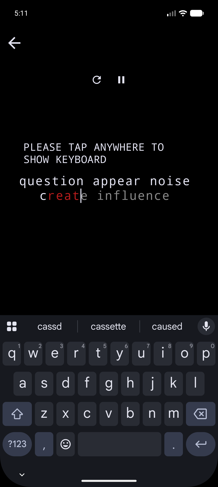 

**Wynik testu:** OK

## FR-10 - Wgląd w 10 poprzednich gier

##### TC-16 - Możliwość wyświetlenia statystyk z poprzednich 10 gier ARCADE
**Opis:** Sprawdzenie, czy widoczne są statystyki poprzednich 10 gier
**Kroki do wykonania:**
1. Rozegraj parę gier w trybie Arcade
2. Wejdź w profil i wybierz ARCADE
3. Zobacz czy widoczna jest tabela z wynikami
**Oczekiwany rezultat:**  
Tabela zawiera N-ostatnich wyników(max 10)
**Rzeczywisty rezultat:**  

  
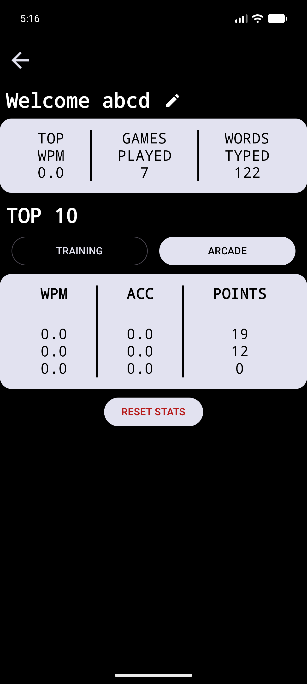 

**Wynik testu:** OK

##### TC-17 - Możliwość wyświetlenia statystyk z poprzednich 10 gier Training
**Opis:** Sprawdzenie, czy widoczne są statystyki poprzednich 10 gier
**Kroki do wykonania:**
1. Rozegraj parę gier w trybie Training
2. Wejdź w profil  i wybierz Training
3. Zobacz czy widoczna jest tabela z wynikami
**Oczekiwany rezultat:**  
Tabela zawiera N-ostatnich wyników(max 10)
**Rzeczywisty rezultat:**  

  
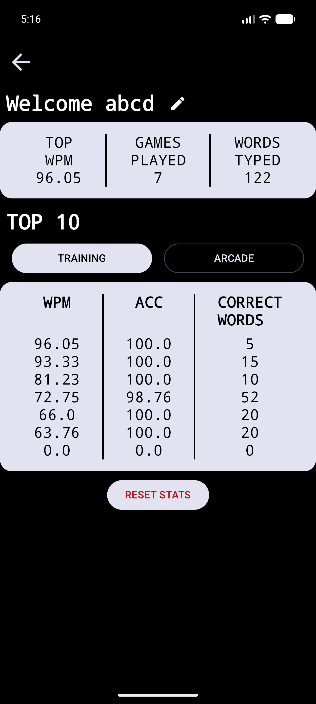 

**Wynik testu:** OK

##### TC-18 - Możliwość Resetu Statystyk
Opis:** Sprawdzenie, czy można zresetować swoje statystyki,
**Kroki do wykonania:**
1. Rozegraj parę gier w dowolnym trybie
2. Wejdź w profil i kliknij RESET STATS
3. Zobacz czy widoczny jest napis "NO DATA"
**Oczekiwany rezultat:**  
Widoczny napis NO DATA
**Rzeczywisty rezultat:**  

  
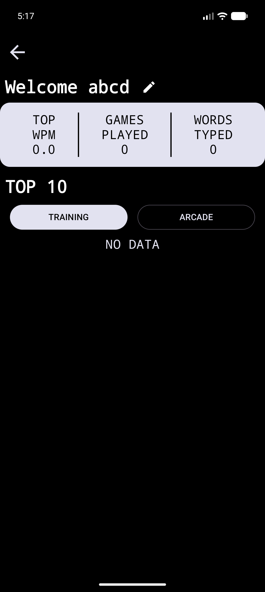 

**Wynik testu:** OK